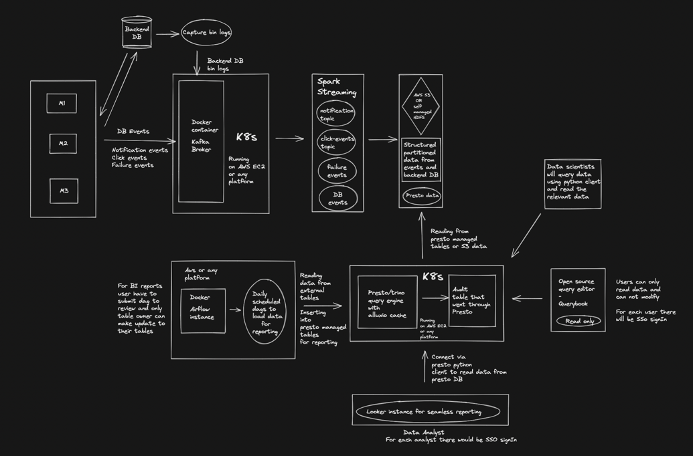
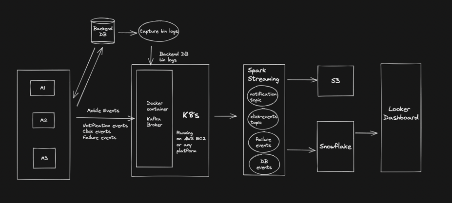
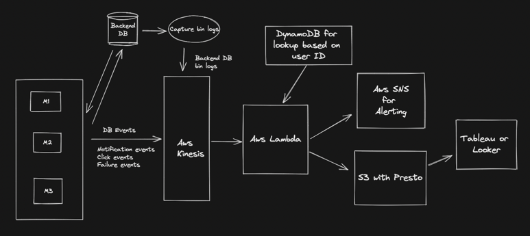
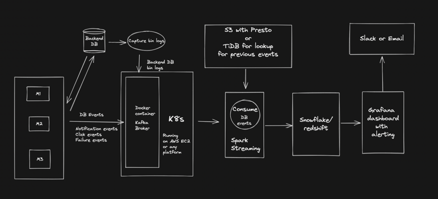

# Reedsy Data Engineering challenge

## Question 1 :
Write a paragraph about yourself, your hobbies and your major achievements in your career or study so far.
Add another one about your professional experience and commercial projects you've been involved with.

### Answer :
Sanni is a person of many trades. His interest is in Chess, music and technology. Sanni is a professional with 7 years of data engineering and analytics experience in media, cloud communications, financial technology, and health care.
He's great at helping companies create data collection and processing tools for high volume, velocity, veracity and variety.
Sanni has worked on project where it requires designing and building scalable, fault-tolerant products, such as data platform and ingestion frameworks, self-serve analytics and reporting systems, data lakes, and data warehouses on-premises or in the AWS ecosystem.
He delivers low latency data processing systems and is skilled at system design, data modeling, ETL, stream processing, and product analytics.
Heruwala is capable of building data processing systems using diverse components, including Spark, HDFS, S3, Lambda, Hive, DynamoDB, and Redis.
Sanni capably defines analytics charters and helps organizations move towards data-driven decision-making.

## Part A
Consider Bookly, an internet company that owns a marketplace for selling books, a blog and other complementary online products with an overlapping user base.
Each product is backed by its own independent Ruby web server and relational SQL database.
Bookly has approx 100k books and 1M users.

## Question 2
The Marketing Team at Bookly wants to merge and analyze all the data that is being collected by the different products in order to extract useful business insights of various kinds.
Examples of such analytics include (but are not restricted to):

List all-time top rated books and trending ones;
Measure user sign-up rate over certain periods (weekly, quarterly, etc);
Show the total number of real-time (current) page views for any given book description page (product page);

Design a conceptual data pipeline to drive and aggregate data from all the different sources to ultimately be accessible by a user-friendly data exploration/dashboarding tool of your choice. Feel free to pick any technology available (e.g. open source, cloud providers, etc.).

Describe the different components of the architecture, tools involved and compare possible approaches.

### Answer :

#### Approach 1 - Data Lake with presto



- In this design I am considering all events coming from backend sql database and the events coming from the web server.
- The events from the web server are in the form of bin logs(using debezium or maxwell) and will be streamed to the data lake using Kafka.
- In between we will be using Spark Structured Streaming to process the data and write it to the data lake.
- The data lake will be in the form of S3 buckets and will be partitioned by date and time.
- The data lake will be used to store the data and will be used for further processing using presto or spark.
- Let say we want to transform this data on scheduled basis then we can use airflow to schedule the jobs and use presto python
  client to process the data and write it to the data warehouse.
- Presto will also be used to query data via query book, which is an alternative tool to analyse data.
- For daashboards we can use tools like looker or tableau to query the data warehouse and create dashboards.
- Here I have used looker which had seemless integration with presto and can be used to query the data warehouse and create dashboards.

Pros:
- This approach is very scalable and can handle large amount of data.
- It is very cost-effective as we are using S3 buckets for data lake.
- We can use presto to query the data lake and create dashboards.
- We can use airflow to schedule the jobs and use presto python client to process the data and write it to the data warehouse.

Cons:
- We need to have a good understanding of presto and airflow to implement this approach.
- We need to manage infrastructure for this approach.

#### Approach 2 - Data Lake with snowflake



- In this design I am considering all events coming from backend sql database and the events coming from the web server.
- Instead of using presto, we can have a data warehouse in the form of snowflake.
- All events will be stored in data lake and also in snowflake transforming via spark structured streaming.
- This use case is very good for snowflake as it is a cloud data warehouse and can handle large amount of data.

Pros:
- This approach is very scalable and can handle large amount of data.
- It has minimal infrastructure management.
- We can use snowflake to query the data lake and create dashboards.

Cons:
- We need to have a good understanding of snowflake to implement this approach.
- It is not cost-effective as we scale.

## Question 3
The Customer Support team spends considerable time scanning through customer reviews and comments in order to filter out illegitimate ones.
Multiple factors can contribute to label comments as authentic or not:

Comment is made by a registered user vs. anonymous;
Level of user activity (eg: number of past reviews and comments);
Content of the comment (eg: unauthorized advertising)
In order to automate the filtering process, design a conceptual, real-time, decision support system that takes data as input (user properties, user actions, content, etc) and automatically labels comments as legitimate/illegitimate for the Customer Support Team to quickly flag and remove the unwanted.

Describe the different components of the architecture, tools involved and compare possible approaches.

### Answer :

#### Approach 1 - Aws cloud solution with Fanout design



- In this design I am considering all events coming from backend sql database and the events coming from the web server.
- The events from the web server are in the form of bin logs(using debezium or maxwell) and will be streamed to the AWS Kinesis.
- This is fanout design where we will be using AWS Lambda to process the data and read past events to identify legitimate comments.
- For lookup store we can dynamodb for faster lookup based on user id.
- For alerting, we can use AWS SNS to alert the customer support team.
- For dashboard, we can use Tableau to show the results.

Pros:
- This approach has minimal infrastructure management.
- It is easy to implement and can be used to scale with the number of users.
- It is less complex and less moving parts.

Cons:
- Totalled cost of ownership is high as we are using AWS services.
- We need to have a good understanding of AWS services to implement this approach.
- Cost can be high as we scale.

#### Approach 2 - spark streaming with snowflake



- In this design I am considering all events coming from backend sql database and the events coming from the web server.
- The events from the web server are in the form of bin logs(using debezium or maxwell) and will be streamed to the data lake using Kafka.
- In between we will be using Spark Structured Streaming to process the data and read past events to identify legitimate comments.
- For lookup store we can either use presto or TiDB for faster lookup.
- The labeled data will be stored in snowflake and will be used by dashboarding tool to show the results.
- For dashboard, we can use grafana to alert the customer support team.

Pros:
- This approach is very scalable and can handle large amount of data.
- It can scale with the number of users.

Cons:
- We need to manage infrastructure for this approach and it is not cost-effective as we scale.
- Too many moving parts and can be complex to implement.

## Part B

The marketing Team at Bookly introduced A/B Testing on their blog - each blog post will show a given registration popup
from a set of pre-configured popups. The raw dataset in dataset.tsv offers a table with various content properties and
the conversion rates for each combination of blog post and registration popup.

### Question 4

What is the major contributor to user registrations?
In other words, what is the most relevant factor that contributes the most to convert user views into user registrations?

Describe in detail all the steps you take to perform the analysis,
provide code snippets, relevant data transformations and results.

### Answer :

```
# read data from csv file

schema = StructType(
    [
        StructField("popup_name", StringType(), True),
        StructField("blog_post_url", StringType(), True),
        StructField("popup_version|start_date|popup_category", StringType(), True),
        StructField("popup_header", StringType(), True),
        StructField("popup_description", StringType(), True),
        StructField("popup_image_url", StringType(), True),
        StructField("popup_title", StringType(), True),
        StructField("views", IntegerType(), True),
        StructField("registrations", IntegerType(), True)
    ]
)

df = spark.read.option("delimiter", "\t").option("multiline", "true") \
    .option("quote", '"') \
    .option("header", "true") \
    .option("escape", "\\") \
    .option("escape", '"') \
    .csv("data/dataset.tsv", header=True, schema=schema) \
    .withColumnRenamed("popup_version|start_date|popup_category", "array_fields")

# cast array_fields to array type and explode it to get popup_version, start_date, popup_category

df = df.withColumn("array_fields", split(regexp_replace("array_fields", "[\[\]]", ""), "\",\"")) \
    .withColumn("popup_version", regexp_replace(col("array_fields")[0], '"', "")) \
    .withColumn("start_date", regexp_replace(col("array_fields")[1], '"', "")) \
    .withColumn("popup_category", regexp_replace(col("array_fields")[2], '"', "")) \
    .drop("array_fields")

# group popup_category and get sum of views and registrations

df1 = df.groupBy("popup_category") \
    .agg(sum("views").alias("views"),
         sum("registrations").alias("registrations"),
         round(sum("registrations") / sum("views"), 3).alias("conversion_rate"),
         round(sum("registrations") / 47432, 3).alias("registration_rate")) \
    .orderBy(desc("registration_rate"))

+-----------------------------------------------+------+-------------+---------------+-----------------+
|popup_category                                 |views |registrations|conversion_rate|registration_rate|
+-----------------------------------------------+------+-------------+---------------+-----------------+
|Perfecting your Craft                          |845810|20685        |0.024          |0.436            |
|generator                                      |887481|10822        |0.012          |0.228            |
|Understanding Publishing                       |280497|8127         |0.029          |0.171            |
|Perfecting your Craft, Understanding Publishing|52276 |1617         |0.031          |0.034            |
|Book Design                                    |75068 |1512         |0.02           |0.032            |
|Book Marketing, Understanding Publishing       |21833 |1120         |0.051          |0.024            |
|discovery                                      |381038|994          |0.003          |0.021            |
|                                               |45598 |924          |0.02           |0.019            |
|Book Marketing                                 |19733 |623          |0.032          |0.013            |
|Book Design, Understanding Publishing          |17682 |364          |0.021          |0.008            |
+-----------------------------------------------+------+-------------+---------------+-----------------+
```


- The major contributor to user registrations is the popup_category.
- The popup_category is the most relevant factor that contributes the most to convert user views into user registrations.
- As we can see from the above stats, the popup_category has the highest registration_rate(per category registration/total registration) of 0.436
- Specially `Perfecting your Craft` category has the highest registration_rate of 0.436.
- The next category is `generator` with registration_rate of 0.228, which is almost half of the `Perfecting your Craft` category.
- We can also calculate by other fields, but I see higher relevance in popup_category, which can proved by looking at the views.

#### Appaoch - Using pyspark

- Reading data from tsv file using spark dataframe.
- Applying proper schema to the dataframe.
- Extracting `popup_version|start_date|popup_category`
- Grouping by `popup_category` and calculating the registration_rate.
- Similarly, we can calculate the conversion_rate for each fields.
- We can see category can has higher impact then any other field.

### Question 5

Explore the dataset. What other insights can be extracted?

### Answer :

- We can see that the `popup_version` has only 2 values `A` and `B`.
- There are 23 unique values in `popup_category` field.
- Having assigned to multiple categories, we can see that the `Book Design, Understanding Publishing` has the lowest impact on registration.
- There are 18 pages in the blog, which has 100% conversion rate, it seems little odd that all of them are having 21 views and 21 registrations.

